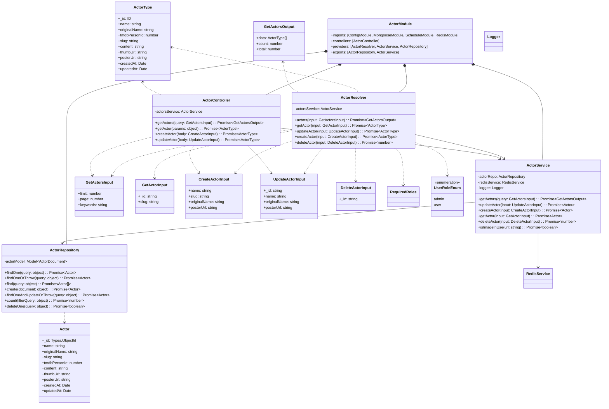

```mermaid
classDiagram
    %% Actor Module classes
    class ActorModule {
        +imports: [ConfigModule, MongooseModule, ScheduleModule, RedisModule]
        +controllers: [ActorController]
        +providers: [ActorResolver, ActorService, ActorRepository]
        +exports: [ActorRepository, ActorService]
    }

    class ActorService {
        -actorRepo: ActorRepository
        -redisService: RedisService
        -logger: Logger
        +getActors(query: GetActorsInput): Promise~GetActorsOutput~
        +updateActor(input: UpdateActorInput): Promise~Actor~
        +createActor(input: CreateActorInput): Promise~Actor~
        +getActor(input: GetActorInput): Promise~Actor~
        +deleteActor(input: DeleteActorInput): Promise~number~
        +isImageInUse(url: string): Promise~boolean~
    }

    class ActorRepository {
        -actorModel: Model~ActorDocument~
        +findOne(query: object): Promise~Actor~
        +findOneOrThrow(query: object): Promise~Actor~
        +find(query: object): Promise~Actor[]~
        +create(document: object): Promise~Actor~
        +findOneAndUpdateOrThrow(query: object): Promise~Actor~
        +count(filterQuery: object): Promise~number~
        +deleteOne(query: object): Promise~boolean~
    }

    class ActorResolver {
        -actorsService: ActorService
        +actors(input: GetActorsInput): Promise~GetActorsOutput~
        +getActor(input: GetActorInput): Promise~ActorType~
        +updateActor(input: UpdateActorInput): Promise~ActorType~
        +createActor(input: CreateActorInput): Promise~ActorType~
        +deleteActor(input: DeleteActorInput): Promise~number~
    }

    class ActorController {
        -actorsService: ActorService
        +getActors(query: GetActorsInput): Promise~GetActorsOutput~
        +getActor(params: object): Promise~ActorType~
        +createActor(body: CreateActorInput): Promise~ActorType~
        +updateActor(body: UpdateActorInput): Promise~ActorType~
    }

    %% Domain models
    class Actor {
        +_id: Types.ObjectId
        +name: string
        +originalName: string
        +slug: string
        +tmdbPersonId: number
        +content: string
        +thumbUrl: string
        +posterUrl: string
        +createdAt: Date
        +updatedAt: Date
    }

    %% DTOs and Input/Output types
    class ActorType {
        +_id: ID
        +name: string
        +originalName: string
        +tmdbPersonId: number
        +slug: string
        +content: string
        +thumbUrl: string
        +posterUrl: string
        +createdAt: Date
        +updatedAt: Date
    }

    class GetActorsOutput {
        +data: ActorType[]
        +count: number
        +total: number
    }

    class GetActorsInput {
        +limit: number
        +page: number
        +keywords: string
    }

    class GetActorInput {
        +_id: string
        +slug: string
    }

    class CreateActorInput {
        +name: string
        +slug: string
        +originalName: string
        +posterUrl: string
    }

    class UpdateActorInput {
        +_id: string
        +name: string
        +originalName: string
        +posterUrl: string
    }

    class DeleteActorInput {
        +_id: string
    }

    %% External Dependencies
    class RedisService
    class Logger
    class RequiredRoles
    class UserRoleEnum {
        <<enumeration>>
        admin
        user
    }

    %% Relationships within Actor Module
    ActorModule *-- ActorResolver
    ActorModule *-- ActorService
    ActorModule *-- ActorRepository
    ActorModule *-- ActorController

    ActorResolver --> ActorService
    ActorController --> ActorService
    ActorService --> ActorRepository
    ActorService --> RedisService
    ActorRepository ..> Actor

    %% Return type relationships
    ActorType <.. ActorResolver
    GetActorsOutput <.. ActorResolver
    ActorType <.. ActorController

    %% Input relationships
    ActorResolver ..> GetActorsInput
    ActorResolver ..> GetActorInput
    ActorResolver ..> CreateActorInput
    ActorResolver ..> UpdateActorInput
    ActorResolver ..> DeleteActorInput

    ActorController ..> GetActorsInput
    ActorController ..> CreateActorInput
    ActorController ..> UpdateActorInput

    %% Decorator relationships
    ActorResolver ..> RequiredRoles
    ActorResolver ..> UserRoleEnum
``` 
