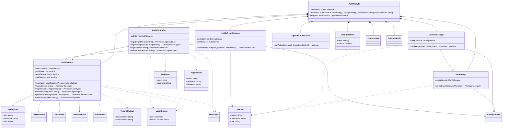

```mermaid
classDiagram
    %% Auth Module classes
    class AuthModule {
        -controllers: [AuthController]
        -providers: [AuthService, JwtStrategy, JwtGqlStrategy, JwtRefreshStrategy, OptionalAuthGuard]
        +exports: [AuthService, OptionalAuthGuard]
    }

    class AuthService {
        -usersService: UsersService
        -jwtService: JwtService
        -redisService: RedisService
        -mailService: MailService
        +login(user: UserType): Promise~LoginOutput~
        +logout(token: string): Promise~boolean~
        +register(input: RegisterInput): Promise~UserType~
        +refreshToken(token: string): Promise~LoginOutput~
        +generateTokens(payload: JwtPayload): Promise~TokensOutput~
        +verifyToken(token: string): Promise~JwtPayload~
    }

    class AuthController {
        -authService: AuthService
        +login(loginDto: LoginDto): Promise~LoginOutput~
        +register(registerDto: RegisterDto): Promise~UserType~
        +logout(token: string): Promise~boolean~
        +refreshToken(token: string): Promise~LoginOutput~
    }

    class JwtStrategy {
        -configService: ConfigService
        +validate(payload: JwtPayload): Promise~UserJwt~
    }

    class JwtRefreshStrategy {
        -configService: ConfigService
        -authService: AuthService
        +validate(req: Request, payload: JwtPayload): Promise~UserJwt~
    }

    class JwtGqlStrategy {
        -configService: ConfigService
        +validate(payload: JwtPayload): Promise~UserJwt~
    }

    class OptionalAuthGuard {
        +canActivate(context: ExecutionContext): boolean
    }

    %% Decorators
    class RequiredRoles {
        +roles: string[]
        +options?: object
    }

    class CurrentUser {
    }

    class OptionalAuth {
    }

    %% Common Types
    class JwtPayload {
        +sub: string
        +username: string
        +role: string
    }

    class UserJwt {
        +userId: string
        +username: string
        +role: string
    }

    class TokensOutput {
        +accessToken: string
        +refreshToken: string
    }

    class LoginOutput {
        +user: UserType
        +tokens: TokensOutput
    }
    
    class LoginDto {
        +email: string
        +password: string
    }

    class RegisterDto {
        +email: string
        +password: string
        +fullName: string
    }

    %% External Dependencies
    class UsersService
    class UserType
    class JwtService
    class RedisService
    class MailService
    class ConfigService

    %% Relationships within Auth Module
    AuthModule *-- AuthService
    AuthModule *-- AuthController
    AuthModule *-- JwtStrategy
    AuthModule *-- JwtGqlStrategy
    AuthModule *-- JwtRefreshStrategy
    AuthModule *-- OptionalAuthGuard
    AuthModule *-- RequiredRoles
    AuthModule *-- CurrentUser
    AuthModule *-- OptionalAuth

    AuthController --> AuthService
    JwtGqlStrategy --|> JwtStrategy
    JwtRefreshStrategy --> AuthService
    AuthService --> JwtPayload
    JwtStrategy ..> UserJwt
    JwtGqlStrategy ..> UserJwt
    JwtRefreshStrategy ..> UserJwt

    %% External dependencies relationships
    AuthService --> UsersService
    AuthService --> JwtService
    AuthService --> RedisService
    AuthService --> MailService
    JwtStrategy --> ConfigService
    JwtGqlStrategy --> ConfigService
    JwtRefreshStrategy --> ConfigService
    AuthService ..> UserType
    AuthService ..> LoginOutput
    AuthService ..> TokensOutput
    AuthController ..> LoginDto
    AuthController ..> RegisterDto
    AuthController ..> LoginOutput
    AuthController ..> UserType
``` 
