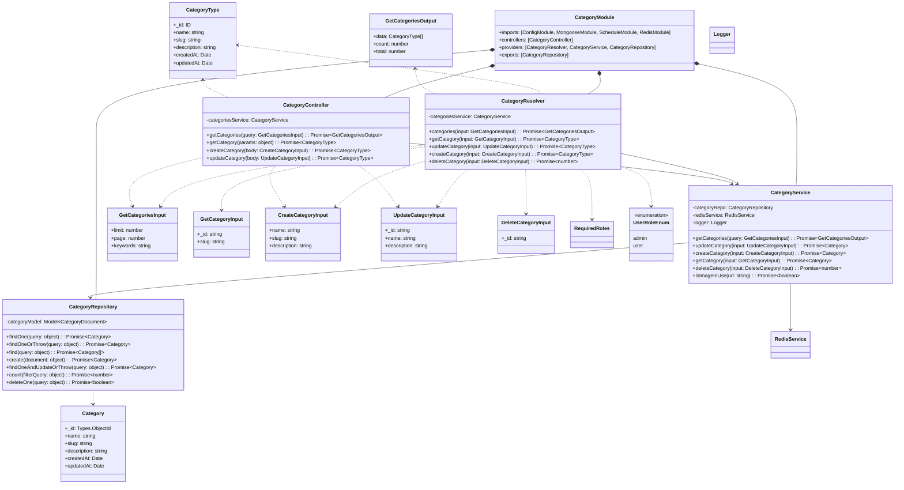

```mermaid
classDiagram
    %% Category Module classes
    class CategoryModule {
        +imports: [ConfigModule, MongooseModule, ScheduleModule, RedisModule]
        +controllers: [CategoryController]
        +providers: [CategoryResolver, CategoryService, CategoryRepository]
        +exports: [CategoryRepository]
    }

    class CategoryService {
        -categoryRepo: CategoryRepository
        -redisService: RedisService
        -logger: Logger
        +getCategories(query: GetCategoriesInput): Promise~GetCategoriesOutput~
        +updateCategory(input: UpdateCategoryInput): Promise~Category~
        +createCategory(input: CreateCategoryInput): Promise~Category~
        +getCategory(input: GetCategoryInput): Promise~Category~
        +deleteCategory(input: DeleteCategoryInput): Promise~number~
        +isImageInUse(url: string): Promise~boolean~
    }

    class CategoryRepository {
        -categoryModel: Model~CategoryDocument~
        +findOne(query: object): Promise~Category~
        +findOneOrThrow(query: object): Promise~Category~
        +find(query: object): Promise~Category[]~
        +create(document: object): Promise~Category~
        +findOneAndUpdateOrThrow(query: object): Promise~Category~
        +count(filterQuery: object): Promise~number~
        +deleteOne(query: object): Promise~boolean~
    }

    class CategoryResolver {
        -categoriesService: CategoryService
        +categories(input: GetCategoriesInput): Promise~GetCategoriesOutput~
        +getCategory(input: GetCategoryInput): Promise~CategoryType~
        +updateCategory(input: UpdateCategoryInput): Promise~CategoryType~
        +createCategory(input: CreateCategoryInput): Promise~CategoryType~
        +deleteCategory(input: DeleteCategoryInput): Promise~number~
    }

    class CategoryController {
        -categoriesService: CategoryService
        +getCategories(query: GetCategoriesInput): Promise~GetCategoriesOutput~
        +getCategory(params: object): Promise~CategoryType~
        +createCategory(body: CreateCategoryInput): Promise~CategoryType~
        +updateCategory(body: UpdateCategoryInput): Promise~CategoryType~
    }

    %% Domain models
    class Category {
        +_id: Types.ObjectId
        +name: string
        +slug: string
        +description: string
        +createdAt: Date
        +updatedAt: Date
    }

    %% DTOs and Input/Output types
    class CategoryType {
        +_id: ID
        +name: string
        +slug: string
        +description: string
        +createdAt: Date
        +updatedAt: Date
    }

    class GetCategoriesOutput {
        +data: CategoryType[]
        +count: number
        +total: number
    }

    class GetCategoriesInput {
        +limit: number
        +page: number
        +keywords: string
    }

    class GetCategoryInput {
        +_id: string
        +slug: string
    }

    class CreateCategoryInput {
        +name: string
        +slug: string
        +description: string
    }

    class UpdateCategoryInput {
        +_id: string
        +name: string
        +description: string
    }

    class DeleteCategoryInput {
        +_id: string
    }

    %% External Dependencies
    class RedisService
    class Logger
    class RequiredRoles
    class UserRoleEnum {
        <<enumeration>>
        admin
        user
    }

    %% Relationships within Category Module
    CategoryModule *-- CategoryResolver
    CategoryModule *-- CategoryService
    CategoryModule *-- CategoryRepository
    CategoryModule *-- CategoryController

    CategoryResolver --> CategoryService
    CategoryController --> CategoryService
    CategoryService --> CategoryRepository
    CategoryService --> RedisService
    CategoryRepository ..> Category

    %% Return type relationships
    CategoryType <.. CategoryResolver
    GetCategoriesOutput <.. CategoryResolver
    CategoryType <.. CategoryController

    %% Input relationships
    CategoryResolver ..> GetCategoriesInput
    CategoryResolver ..> GetCategoryInput
    CategoryResolver ..> CreateCategoryInput
    CategoryResolver ..> UpdateCategoryInput
    CategoryResolver ..> DeleteCategoryInput

    CategoryController ..> GetCategoriesInput
    CategoryController ..> CreateCategoryInput
    CategoryController ..> UpdateCategoryInput

    %% Decorator relationships
    CategoryResolver ..> RequiredRoles
    CategoryResolver ..> UserRoleEnum
``` 
