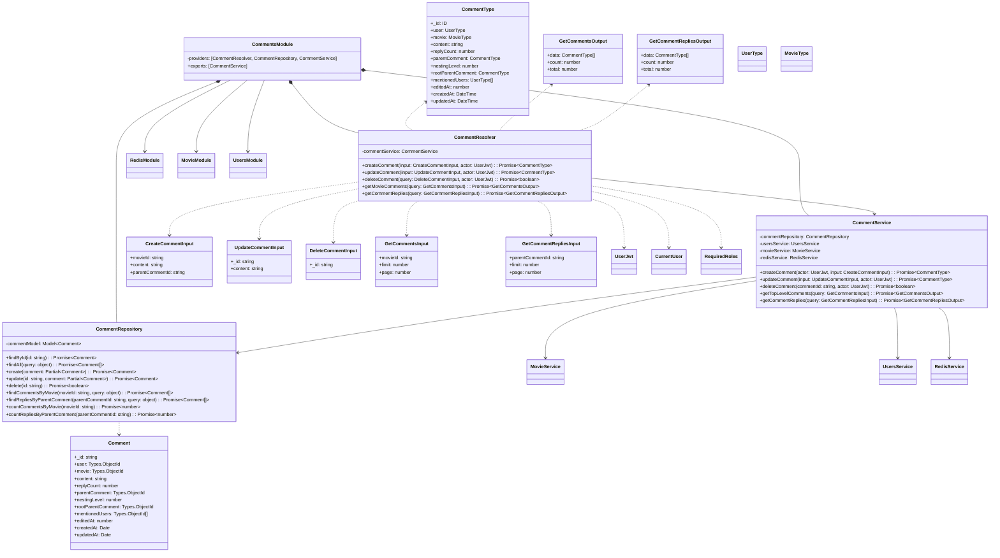

```mermaid
classDiagram
    %% Comments Module classes
    class CommentsModule {
        -providers: [CommentResolver, CommentRepository, CommentService]
        +exports: [CommentService]
    }

    class CommentResolver {
        -commentService: CommentService
        +createComment(input: CreateCommentInput, actor: UserJwt): Promise~CommentType~
        +updateComment(input: UpdateCommentInput, actor: UserJwt): Promise~CommentType~
        +deleteComment(query: DeleteCommentInput, actor: UserJwt): Promise~boolean~
        +getMovieComments(query: GetCommentsInput): Promise~GetCommentsOutput~
        +getCommentReplies(query: GetCommentRepliesInput): Promise~GetCommentRepliesOutput~
    }

    class CommentService {
        -commentRepository: CommentRepository
        -usersService: UsersService
        -movieService: MovieService
        -redisService: RedisService
        +createComment(actor: UserJwt, input: CreateCommentInput): Promise~CommentType~
        +updateComment(input: UpdateCommentInput, actor: UserJwt): Promise~CommentType~
        +deleteComment(commentId: string, actor: UserJwt): Promise~boolean~
        +getTopLevelComments(query: GetCommentsInput): Promise~GetCommentsOutput~
        +getCommentReplies(query: GetCommentRepliesInput): Promise~GetCommentRepliesOutput~
    }

    class CommentRepository {
        -commentModel: Model~Comment~
        +findById(id: string): Promise~Comment~
        +findAll(query: object): Promise~Comment[]~
        +create(comment: Partial~Comment~): Promise~Comment~
        +update(id: string, comment: Partial~Comment~): Promise~Comment~
        +delete(id: string): Promise~boolean~
        +findCommentsByMovie(movieId: string, query: object): Promise~Comment[]~
        +findRepliesByParentComment(parentCommentId: string, query: object): Promise~Comment[]~
        +countCommentsByMovie(movieId: string): Promise~number~
        +countRepliesByParentComment(parentCommentId: string): Promise~number~
    }

    %% Domain models
    class Comment {
        +_id: string
        +user: Types.ObjectId
        +movie: Types.ObjectId
        +content: string
        +replyCount: number
        +parentComment: Types.ObjectId
        +nestingLevel: number
        +rootParentComment: Types.ObjectId
        +mentionedUsers: Types.ObjectId[]
        +editedAt: number
        +createdAt: Date
        +updatedAt: Date
    }

    %% DTOs and Input/Output types
    class CommentType {
        +_id: ID
        +user: UserType
        +movie: MovieType
        +content: string
        +replyCount: number
        +parentComment: CommentType
        +nestingLevel: number
        +rootParentComment: CommentType
        +mentionedUsers: UserType[]
        +editedAt: number
        +createdAt: DateTime
        +updatedAt: DateTime
    }

    class GetCommentsOutput {
        +data: CommentType[]
        +count: number
        +total: number
    }

    class GetCommentRepliesOutput {
        +data: CommentType[]
        +count: number
        +total: number
    }

    %% Input types
    class CreateCommentInput {
        +movieId: string
        +content: string
        +parentCommentId: string
    }

    class UpdateCommentInput {
        +_id: string
        +content: string
    }

    class DeleteCommentInput {
        +_id: string
    }

    class GetCommentsInput {
        +movieId: string
        +limit: number
        +page: number
    }

    class GetCommentRepliesInput {
        +parentCommentId: string
        +limit: number
        +page: number
    }

    %% External Dependencies
    class UserJwt
    class UserType
    class MovieType
    class MovieService
    class UsersService
    class RedisModule
    class CurrentUser
    class RequiredRoles

    %% Relationships within Comments Module
    CommentsModule *-- CommentResolver
    CommentsModule *-- CommentService
    CommentsModule *-- CommentRepository

    CommentResolver --> CommentService
    CommentService --> CommentRepository
    CommentRepository ..> Comment

    %% Return type relationships
    CommentType <.. CommentResolver
    GetCommentsOutput <.. CommentResolver
    GetCommentRepliesOutput <.. CommentResolver

    %% Input relationships
    CommentResolver ..> CreateCommentInput
    CommentResolver ..> UpdateCommentInput
    CommentResolver ..> DeleteCommentInput
    CommentResolver ..> GetCommentsInput
    CommentResolver ..> GetCommentRepliesInput

    %% External module dependencies
    CommentsModule --> RedisModule
    CommentsModule --> MovieModule
    CommentsModule --> UsersModule

    CommentService --> UsersService
    CommentService --> MovieService
    CommentService --> RedisService

    CommentResolver ..> UserJwt
    CommentResolver ..> CurrentUser
    CommentResolver ..> RequiredRoles
``` 
