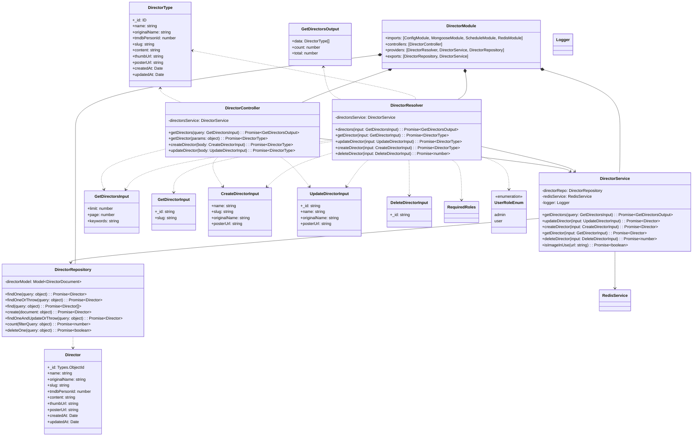

```mermaid
classDiagram
    %% Director Module classes
    class DirectorModule {
        +imports: [ConfigModule, MongooseModule, ScheduleModule, RedisModule]
        +controllers: [DirectorController]
        +providers: [DirectorResolver, DirectorService, DirectorRepository]
        +exports: [DirectorRepository, DirectorService]
    }

    class DirectorService {
        -directorRepo: DirectorRepository
        -redisService: RedisService
        -logger: Logger
        +getDirectors(query: GetDirectorsInput): Promise~GetDirectorsOutput~
        +updateDirector(input: UpdateDirectorInput): Promise~Director~
        +createDirector(input: CreateDirectorInput): Promise~Director~
        +getDirector(input: GetDirectorInput): Promise~Director~
        +deleteDirector(input: DeleteDirectorInput): Promise~number~
        +isImageInUse(url: string): Promise~boolean~
    }

    class DirectorRepository {
        -directorModel: Model~DirectorDocument~
        +findOne(query: object): Promise~Director~
        +findOneOrThrow(query: object): Promise~Director~
        +find(query: object): Promise~Director[]~
        +create(document: object): Promise~Director~
        +findOneAndUpdateOrThrow(query: object): Promise~Director~
        +count(filterQuery: object): Promise~number~
        +deleteOne(query: object): Promise~boolean~
    }

    class DirectorResolver {
        -directorsService: DirectorService
        +directors(input: GetDirectorsInput): Promise~GetDirectorsOutput~
        +getDirector(input: GetDirectorInput): Promise~DirectorType~
        +updateDirector(input: UpdateDirectorInput): Promise~DirectorType~
        +createDirector(input: CreateDirectorInput): Promise~DirectorType~
        +deleteDirector(input: DeleteDirectorInput): Promise~number~
    }

    class DirectorController {
        -directorsService: DirectorService
        +getDirectors(query: GetDirectorsInput): Promise~GetDirectorsOutput~
        +getDirector(params: object): Promise~DirectorType~
        +createDirector(body: CreateDirectorInput): Promise~DirectorType~
        +updateDirector(body: UpdateDirectorInput): Promise~DirectorType~
    }

    %% Domain models
    class Director {
        +_id: Types.ObjectId
        +name: string
        +originalName: string
        +slug: string
        +tmdbPersonId: number
        +content: string
        +thumbUrl: string
        +posterUrl: string
        +createdAt: Date
        +updatedAt: Date
    }

    %% DTOs and Input/Output types
    class DirectorType {
        +_id: ID
        +name: string
        +originalName: string
        +tmdbPersonId: number
        +slug: string
        +content: string
        +thumbUrl: string
        +posterUrl: string
        +createdAt: Date
        +updatedAt: Date
    }

    class GetDirectorsOutput {
        +data: DirectorType[]
        +count: number
        +total: number
    }

    class GetDirectorsInput {
        +limit: number
        +page: number
        +keywords: string
    }

    class GetDirectorInput {
        +_id: string
        +slug: string
    }

    class CreateDirectorInput {
        +name: string
        +slug: string
        +originalName: string
        +posterUrl: string
    }

    class UpdateDirectorInput {
        +_id: string
        +name: string
        +originalName: string
        +posterUrl: string
    }

    class DeleteDirectorInput {
        +_id: string
    }

    %% External Dependencies
    class RedisService
    class Logger
    class RequiredRoles
    class UserRoleEnum {
        <<enumeration>>
        admin
        user
    }

    %% Relationships within Director Module
    DirectorModule *-- DirectorResolver
    DirectorModule *-- DirectorService
    DirectorModule *-- DirectorRepository
    DirectorModule *-- DirectorController

    DirectorResolver --> DirectorService
    DirectorController --> DirectorService
    DirectorService --> DirectorRepository
    DirectorService --> RedisService
    DirectorRepository ..> Director

    %% Return type relationships
    DirectorType <.. DirectorResolver
    GetDirectorsOutput <.. DirectorResolver
    DirectorType <.. DirectorController

    %% Input relationships
    DirectorResolver ..> GetDirectorsInput
    DirectorResolver ..> GetDirectorInput
    DirectorResolver ..> CreateDirectorInput
    DirectorResolver ..> UpdateDirectorInput
    DirectorResolver ..> DeleteDirectorInput

    DirectorController ..> GetDirectorsInput
    DirectorController ..> CreateDirectorInput
    DirectorController ..> UpdateDirectorInput

    %% Decorator relationships
    DirectorResolver ..> RequiredRoles
    DirectorResolver ..> UserRoleEnum
``` 
