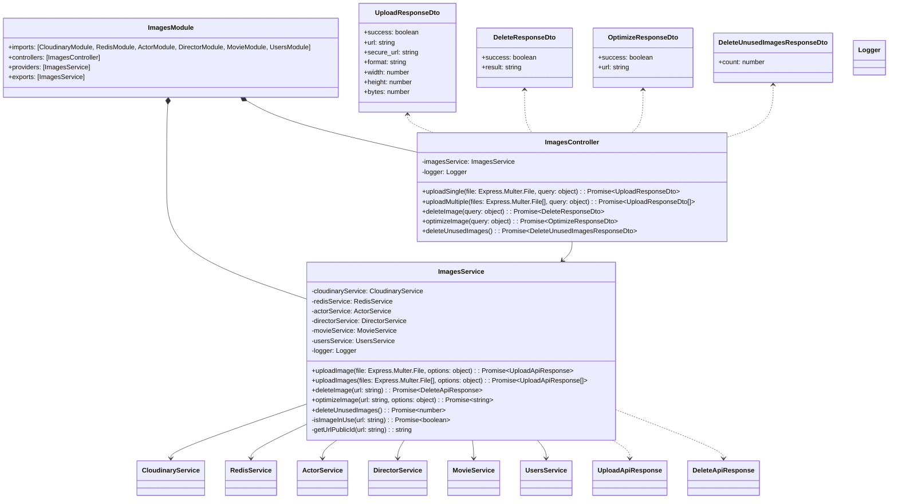

```mermaid
classDiagram
    %% Images Module classes
    class ImagesModule {
        +imports: [CloudinaryModule, RedisModule, ActorModule, DirectorModule, MovieModule, UsersModule]
        +controllers: [ImagesController]
        +providers: [ImagesService]
        +exports: [ImagesService]
    }

    class ImagesService {
        -cloudinaryService: CloudinaryService
        -redisService: RedisService
        -actorService: ActorService
        -directorService: DirectorService
        -movieService: MovieService
        -usersService: UsersService
        -logger: Logger
        +uploadImage(file: Express.Multer.File, options: object): Promise~UploadApiResponse~
        +uploadImages(files: Express.Multer.File[], options: object): Promise~UploadApiResponse[]~
        +deleteImage(url: string): Promise~DeleteApiResponse~
        +optimizeImage(url: string, options: object): Promise~string~
        +deleteUnusedImages(): Promise~number~
        -isImageInUse(url: string): Promise~boolean~
        -getUrlPublicId(url: string): string
    }

    class ImagesController {
        -imagesService: ImagesService
        -logger: Logger
        +uploadSingle(file: Express.Multer.File, query: object): Promise~UploadResponseDto~
        +uploadMultiple(files: Express.Multer.File[], query: object): Promise~UploadResponseDto[]~
        +deleteImage(query: object): Promise~DeleteResponseDto~
        +optimizeImage(query: object): Promise~OptimizeResponseDto~
        +deleteUnusedImages(): Promise~DeleteUnusedImagesResponseDto~
    }

    %% DTOs
    class UploadResponseDto {
        +success: boolean
        +url: string
        +secure_url: string
        +format: string
        +width: number
        +height: number
        +bytes: number
    }

    class DeleteResponseDto {
        +success: boolean
        +result: string
    }

    class OptimizeResponseDto {
        +success: boolean
        +url: string
    }

    class DeleteUnusedImagesResponseDto {
        +count: number
    }

    %% External Dependencies
    class CloudinaryService
    class RedisService
    class ActorService
    class DirectorService
    class MovieService
    class UsersService
    class Logger
    class UploadApiResponse
    class DeleteApiResponse

    %% Relationships within Images Module
    ImagesModule *-- ImagesController
    ImagesModule *-- ImagesService

    ImagesController --> ImagesService

    %% External Dependencies relationships
    ImagesService --> CloudinaryService
    ImagesService --> RedisService
    ImagesService --> ActorService
    ImagesService --> DirectorService
    ImagesService --> MovieService
    ImagesService --> UsersService

    %% Return type relationships
    UploadResponseDto <.. ImagesController
    DeleteResponseDto <.. ImagesController
    OptimizeResponseDto <.. ImagesController
    DeleteUnusedImagesResponseDto <.. ImagesController

    %% Input relationships
    ImagesService ..> UploadApiResponse
    ImagesService ..> DeleteApiResponse
``` 
