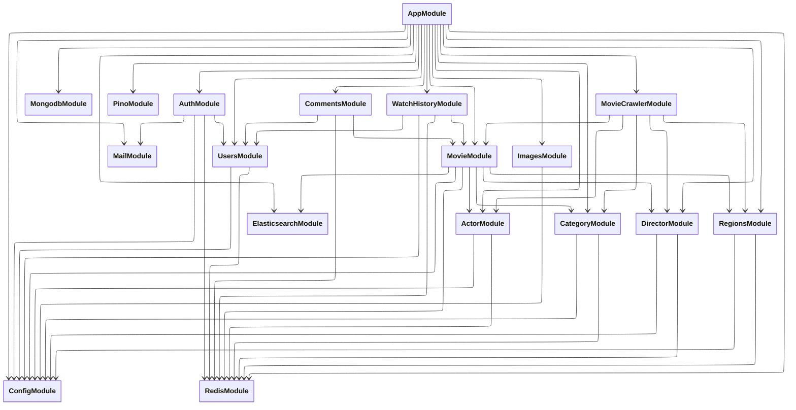

```mermaid
---
config:
  layout: elk
  class:
    hideEmptyMembersBox: true
---
classDiagram
    class ConfigModule
    class MongodbModule
    class RedisModule
    class PinoModule
    class ElasticsearchModule
    class MailModule
    class AuthModule
    class UsersModule
    class MovieModule
    class ActorModule
    class CategoryModule
    class DirectorModule
    class RegionsModule
    class CommentsModule
    class ImagesModule
    class WatchHistoryModule
    class MovieCrawlerModule
    AppModule --> ConfigModule
    AppModule --> MongodbModule
    AppModule --> RedisModule
    AppModule --> PinoModule
    AppModule --> ElasticsearchModule
    AppModule --> MailModule
    AuthModule --> ConfigModule
    AuthModule --> RedisModule
    AuthModule --> MailModule
    MovieModule --> ConfigModule
    MovieModule --> RedisModule
    MovieModule --> ElasticsearchModule
    UsersModule --> ConfigModule
    UsersModule --> RedisModule
    CategoryModule --> ConfigModule
    CategoryModule --> RedisModule
    DirectorModule --> ConfigModule
    DirectorModule --> RedisModule
    ActorModule --> ConfigModule
    ActorModule --> RedisModule
    RegionsModule --> ConfigModule
    RegionsModule --> RedisModule
    CommentsModule --> RedisModule
    ImagesModule --> ConfigModule
    WatchHistoryModule --> ConfigModule
    WatchHistoryModule --> RedisModule
    AuthModule --> UsersModule
    CommentsModule --> UsersModule
    CommentsModule --> MovieModule
    WatchHistoryModule --> UsersModule
    WatchHistoryModule --> MovieModule
    MovieModule --> ActorModule
    MovieModule --> CategoryModule
    MovieModule --> DirectorModule
    MovieModule --> RegionsModule
    MovieCrawlerModule --> MovieModule
    MovieCrawlerModule --> ActorModule
    MovieCrawlerModule --> CategoryModule
    MovieCrawlerModule --> DirectorModule
    MovieCrawlerModule --> RegionsModule
    AppModule --> AuthModule
    AppModule --> UsersModule
    AppModule --> MovieModule
    AppModule --> ActorModule
    AppModule --> CategoryModule
    AppModule --> DirectorModule
    AppModule --> RegionsModule
    AppModule --> CommentsModule
    AppModule --> ImagesModule
    AppModule --> WatchHistoryModule
    AppModule --> MovieCrawlerModule

```
