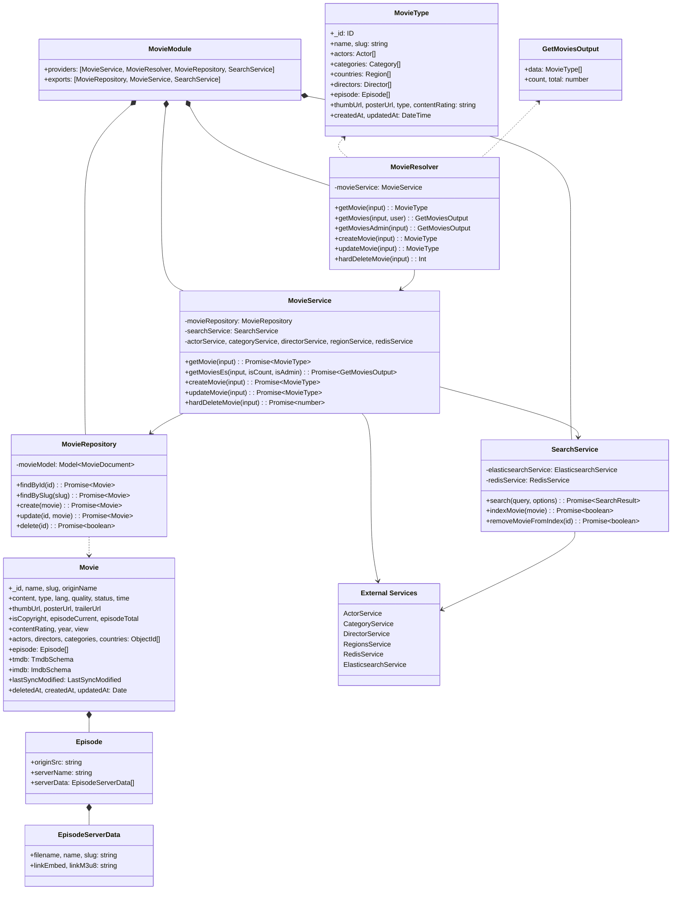

```mermaid
classDiagram
    %% Core Classes
    class MovieModule {
        +providers: [MovieService, MovieResolver, MovieRepository, SearchService]
        +exports: [MovieRepository, MovieService, SearchService]
    }

    class MovieResolver {
        -movieService: MovieService
        +getMovie(input): MovieType
        +getMovies(input, user): GetMoviesOutput
        +getMoviesAdmin(input): GetMoviesOutput
        +createMovie(input): MovieType
        +updateMovie(input): MovieType
        +hardDeleteMovie(input): Int
    }

    class MovieService {
        -movieRepository: MovieRepository
        -searchService: SearchService
        -actorService, categoryService, directorService, regionService, redisService
        +getMovie(input): Promise~MovieType~
        +getMoviesEs(input, isCount, isAdmin): Promise~GetMoviesOutput~
        +createMovie(input): Promise~MovieType~
        +updateMovie(input): Promise~MovieType~
        +hardDeleteMovie(input): Promise~number~
    }

    class MovieRepository {
        -movieModel: Model~MovieDocument~
        +findById(id): Promise~Movie~
        +findBySlug(slug): Promise~Movie~
        +create(movie): Promise~Movie~
        +update(id, movie): Promise~Movie~
        +delete(id): Promise~boolean~
    }

    class SearchService {
        -elasticsearchService: ElasticsearchService
        -redisService: RedisService
        +search(query, options): Promise~SearchResult~
        +indexMovie(movie): Promise~boolean~
        +removeMovieFromIndex(id): Promise~boolean~
    }

    %% Domain Models - Simplified
    class Movie {
        +_id, name, slug, originName
        +content, type, lang, quality, status, time
        +thumbUrl, posterUrl, trailerUrl
        +isCopyright, episodeCurrent, episodeTotal
        +contentRating, year, view
        +actors, directors, categories, countries: ObjectId[]
        +episode: Episode[]
        +tmdb: TmdbSchema
        +imdb: ImdbSchema
        +lastSyncModified: LastSyncModified
        +deletedAt, createdAt, updatedAt: Date
    }

    class Episode {
        +originSrc: string
        +serverName: string
        +serverData: EpisodeServerData[]
    }

    class EpisodeServerData {
        +filename, name, slug: string
        +linkEmbed, linkM3u8: string
    }

    %% Data Transfer Objects
    class MovieType {
        +_id: ID
        +name, slug: string
        +actors: Actor[]
        +categories: Category[]
        +countries: Region[]
        +directors: Director[]
        +episode: Episode[]
        +thumbUrl, posterUrl, type, contentRating: string
        +createdAt, updatedAt: DateTime
    }

    class GetMoviesOutput {
        +data: MovieType[]
        +count, total: number
    }

    %% External Dependencies
    class ExternalServices ["External Services"] {
        ActorService
        CategoryService
        DirectorService
        RegionsService
        RedisService
        ElasticsearchService
    }

    %% Relationships
    MovieModule *-- MovieResolver
    MovieModule *-- MovieService
    MovieModule *-- MovieRepository
    MovieModule *-- SearchService

    MovieResolver --> MovieService
    MovieService --> MovieRepository
    MovieService --> SearchService
    MovieService --> ExternalServices
    SearchService --> ExternalServices

    MovieRepository ..> Movie
    Movie *-- Episode
    Episode *-- EpisodeServerData
    
    MovieType <.. MovieResolver
    GetMoviesOutput <.. MovieResolver
``` 
