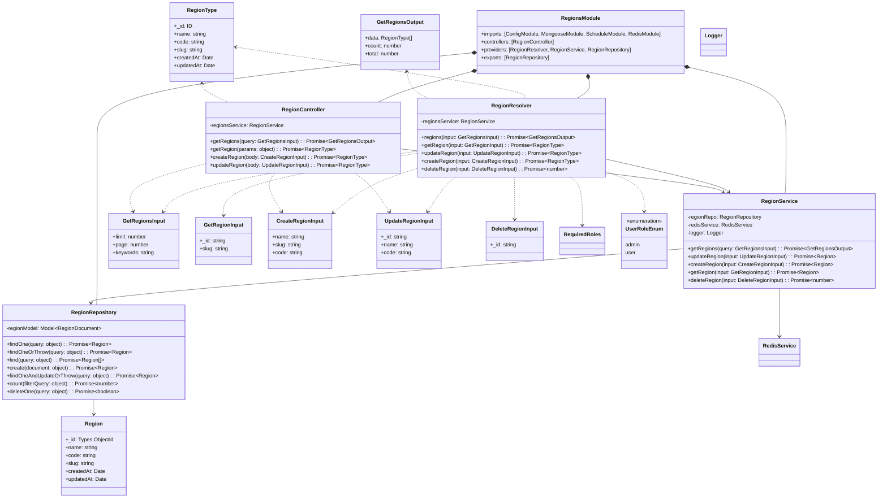

```mermaid
classDiagram
    %% Regions Module classes
    class RegionsModule {
        +imports: [ConfigModule, MongooseModule, ScheduleModule, RedisModule]
        +controllers: [RegionController]
        +providers: [RegionResolver, RegionService, RegionRepository]
        +exports: [RegionRepository]
    }

    class RegionService {
        -regionRepo: RegionRepository
        -redisService: RedisService
        -logger: Logger
        +getRegions(query: GetRegionsInput): Promise~GetRegionsOutput~
        +updateRegion(input: UpdateRegionInput): Promise~Region~
        +createRegion(input: CreateRegionInput): Promise~Region~
        +getRegion(input: GetRegionInput): Promise~Region~
        +deleteRegion(input: DeleteRegionInput): Promise~number~
    }

    class RegionRepository {
        -regionModel: Model~RegionDocument~
        +findOne(query: object): Promise~Region~
        +findOneOrThrow(query: object): Promise~Region~
        +find(query: object): Promise~Region[]~
        +create(document: object): Promise~Region~
        +findOneAndUpdateOrThrow(query: object): Promise~Region~
        +count(filterQuery: object): Promise~number~
        +deleteOne(query: object): Promise~boolean~
    }

    class RegionResolver {
        -regionsService: RegionService
        +regions(input: GetRegionsInput): Promise~GetRegionsOutput~
        +getRegion(input: GetRegionInput): Promise~RegionType~
        +updateRegion(input: UpdateRegionInput): Promise~RegionType~
        +createRegion(input: CreateRegionInput): Promise~RegionType~
        +deleteRegion(input: DeleteRegionInput): Promise~number~
    }

    class RegionController {
        -regionsService: RegionService
        +getRegions(query: GetRegionsInput): Promise~GetRegionsOutput~
        +getRegion(params: object): Promise~RegionType~
        +createRegion(body: CreateRegionInput): Promise~RegionType~
        +updateRegion(body: UpdateRegionInput): Promise~RegionType~
    }

    %% Domain models
    class Region {
        +_id: Types.ObjectId
        +name: string
        +code: string
        +slug: string
        +createdAt: Date
        +updatedAt: Date
    }

    %% DTOs and Input/Output types
    class RegionType {
        +_id: ID
        +name: string
        +code: string
        +slug: string
        +createdAt: Date
        +updatedAt: Date
    }

    class GetRegionsOutput {
        +data: RegionType[]
        +count: number
        +total: number
    }

    class GetRegionsInput {
        +limit: number
        +page: number
        +keywords: string
    }

    class GetRegionInput {
        +_id: string
        +slug: string
    }

    class CreateRegionInput {
        +name: string
        +slug: string
        +code: string
    }

    class UpdateRegionInput {
        +_id: string
        +name: string
        +code: string
    }

    class DeleteRegionInput {
        +_id: string
    }

    %% External Dependencies
    class RedisService
    class Logger
    class RequiredRoles
    class UserRoleEnum {
        <<enumeration>>
        admin
        user
    }

    %% Relationships within Regions Module
    RegionsModule *-- RegionResolver
    RegionsModule *-- RegionService
    RegionsModule *-- RegionRepository
    RegionsModule *-- RegionController

    RegionResolver --> RegionService
    RegionController --> RegionService
    RegionService --> RegionRepository
    RegionService --> RedisService
    RegionRepository ..> Region

    %% Return type relationships
    RegionType <.. RegionResolver
    GetRegionsOutput <.. RegionResolver
    RegionType <.. RegionController

    %% Input relationships
    RegionResolver ..> GetRegionsInput
    RegionResolver ..> GetRegionInput
    RegionResolver ..> CreateRegionInput
    RegionResolver ..> UpdateRegionInput
    RegionResolver ..> DeleteRegionInput

    RegionController ..> GetRegionsInput
    RegionController ..> CreateRegionInput
    RegionController ..> UpdateRegionInput

    %% Decorator relationships
    RegionResolver ..> RequiredRoles
    RegionResolver ..> UserRoleEnum
``` 
