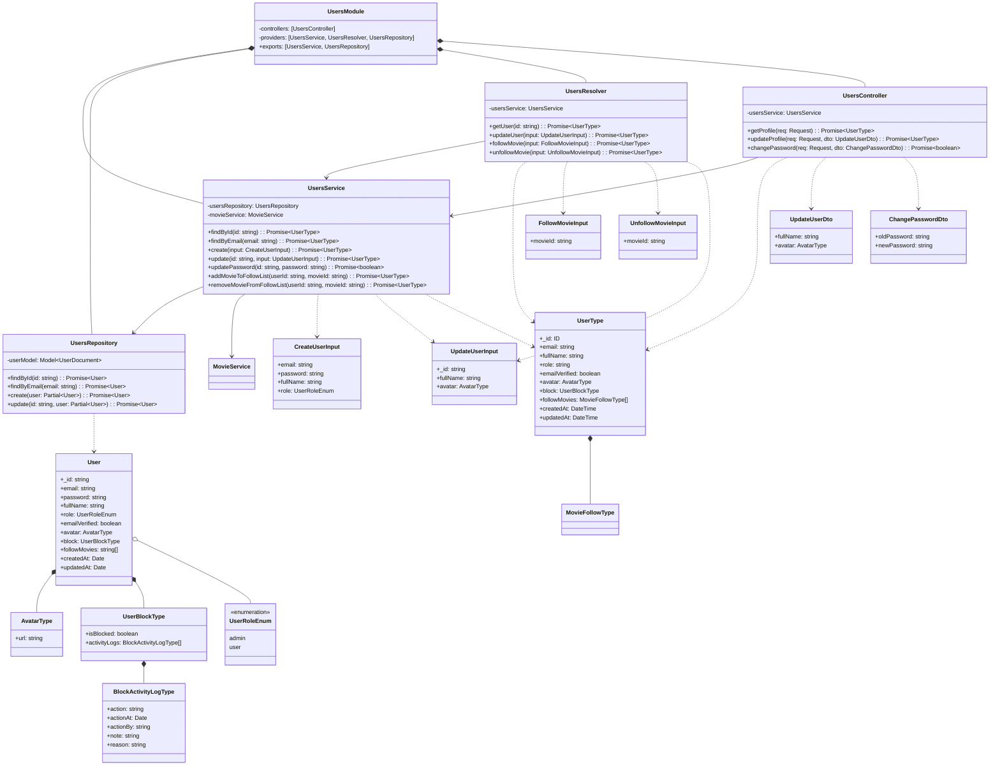

```mermaid
classDiagram
    %% Users Module classes
    class UsersModule {
        -controllers: [UsersController]
        -providers: [UsersService, UsersResolver, UsersRepository]
        +exports: [UsersService, UsersRepository]
    }

    class UsersService {
        -usersRepository: UsersRepository
        -movieService: MovieService
        +findById(id: string): Promise~UserType~
        +findByEmail(email: string): Promise~UserType~
        +create(input: CreateUserInput): Promise~UserType~
        +update(id: string, input: UpdateUserInput): Promise~UserType~
        +updatePassword(id: string, password: string): Promise~boolean~
        +addMovieToFollowList(userId: string, movieId: string): Promise~UserType~
        +removeMovieFromFollowList(userId: string, movieId: string): Promise~UserType~
    }

    class UsersController {
        -usersService: UsersService
        +getProfile(req: Request): Promise~UserType~
        +updateProfile(req: Request, dto: UpdateUserDto): Promise~UserType~
        +changePassword(req: Request, dto: ChangePasswordDto): Promise~boolean~
    }

    class UsersResolver {
        -usersService: UsersService
        +getUser(id: string): Promise~UserType~
        +updateUser(input: UpdateUserInput): Promise~UserType~
        +followMovie(input: FollowMovieInput): Promise~UserType~
        +unfollowMovie(input: UnfollowMovieInput): Promise~UserType~
    }

    class UsersRepository {
        -userModel: Model~UserDocument~
        +findById(id: string): Promise~User~
        +findByEmail(email: string): Promise~User~
        +create(user: Partial~User~): Promise~User~
        +update(id: string, user: Partial~User~): Promise~User~
    }

    %% Domain models
    class User {
        +_id: string
        +email: string
        +password: string
        +fullName: string
        +role: UserRoleEnum
        +emailVerified: boolean
        +avatar: AvatarType
        +block: UserBlockType
        +followMovies: string[]
        +createdAt: Date
        +updatedAt: Date
    }

    class UserRoleEnum {
        <<enumeration>>
        admin
        user
    }

    class AvatarType {
        +url: string
    }

    class UserBlockType {
        +isBlocked: boolean
        +activityLogs: BlockActivityLogType[]
    }

    class BlockActivityLogType {
        +action: string
        +actionAt: Date
        +actionBy: string
        +note: string
        +reason: string
    }

    %% DTOs and Input/Output types
    class UserType {
        +_id: ID
        +email: string
        +fullName: string
        +role: string
        +emailVerified: boolean
        +avatar: AvatarType
        +block: UserBlockType
        +followMovies: MovieFollowType[]
        +createdAt: DateTime
        +updatedAt: DateTime
    }

    class UpdateUserDto {
        +fullName: string
        +avatar: AvatarType
    }

    class ChangePasswordDto {
        +oldPassword: string
        +newPassword: string
    }

    class CreateUserInput {
        +email: string
        +password: string
        +fullName: string
        +role: UserRoleEnum
    }

    class UpdateUserInput {
        +_id: string
        +fullName: string
        +avatar: AvatarType
    }

    class FollowMovieInput {
        +movieId: string
    }

    class UnfollowMovieInput {
        +movieId: string
    }

    %% External Dependencies
    class MovieService
    class MovieFollowType

    %% Relationships within Users Module
    UsersModule *-- UsersService
    UsersModule *-- UsersRepository
    UsersModule *-- UsersResolver
    UsersModule *-- UsersController

    UsersService --> UsersRepository
    UsersResolver --> UsersService
    UsersController --> UsersService
    UsersRepository ..> User

    User *-- AvatarType
    User *-- UserBlockType
    UserBlockType *-- BlockActivityLogType
    User o-- UserRoleEnum

    %% External dependencies relationships
    UsersService --> MovieService
    UserType *-- MovieFollowType

    %% DTO relationships
    UsersResolver ..> UserType
    UsersResolver ..> FollowMovieInput
    UsersResolver ..> UnfollowMovieInput
    UsersResolver ..> UpdateUserInput

    UsersController ..> UserType
    UsersController ..> UpdateUserDto
    UsersController ..> ChangePasswordDto

    UsersService ..> CreateUserInput
    UsersService ..> UpdateUserInput
    UsersService ..> UserType
``` 
