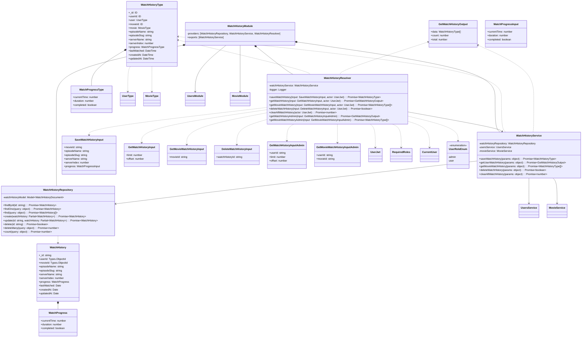

```mermaid
classDiagram
    %% WatchHistory Module classes
    class WatchHistoryModule {
        -providers: [WatchHistoryRepository, WatchHistoryService, WatchHistoryResolver]
        +exports: [WatchHistoryService]
    }

    class WatchHistoryResolver {
        -watchHistoryService: WatchHistoryService
        -logger: Logger
        +saveWatchHistory(input: SaveWatchHistoryInput, actor: UserJwt): Promise~WatchHistoryType~
        +getWatchHistory(input: GetWatchHistoryInput, actor: UserJwt): Promise~GetWatchHistoryOutput~
        +getMovieWatchHistory(input: GetMovieWatchHistoryInput, actor: UserJwt): Promise~WatchHistoryType[]~
        +deleteWatchHistory(input: DeleteWatchHistoryInput, actor: UserJwt): Promise~boolean~
        +clearAllWatchHistory(actor: UserJwt): Promise~number~
        +getWatchHistoryAdmin(input: GetWatchHistoryInputAdmin): Promise~GetWatchHistoryOutput~
        +getMovieWatchHistoryAdmin(input: GetMovieWatchHistoryInputAdmin): Promise~WatchHistoryType[]~
    }

    class WatchHistoryService {
        -watchHistoryRepository: WatchHistoryRepository
        -usersService: UsersService
        -movieService: MovieService
        +saveWatchHistory(params: object): Promise~WatchHistoryType~
        +getUserWatchHistory(params: object): Promise~GetWatchHistoryOutput~
        +getMovieWatchHistory(params: object): Promise~WatchHistoryType[]~
        +deleteWatchHistory(params: object): Promise~boolean~
        +clearAllWatchHistory(params: object): Promise~number~
    }

    class WatchHistoryRepository {
        -watchHistoryModel: Model~WatchHistoryDocument~
        +findById(id: string): Promise~WatchHistory~
        +findOne(query: object): Promise~WatchHistory~
        +find(query: object): Promise~WatchHistory[]~
        +create(watchHistory: Partial~WatchHistory~): Promise~WatchHistory~
        +update(id: string, watchHistory: Partial~WatchHistory~): Promise~WatchHistory~
        +delete(id: string): Promise~boolean~
        +deleteMany(query: object): Promise~number~
        +count(query: object): Promise~number~
    }

    %% Domain models
    class WatchHistory {
        +_id: string
        +userId: Types.ObjectId
        +movieId: Types.ObjectId
        +episodeName: string
        +episodeSlug: string
        +serverName: string
        +serverIndex: number
        +progress: WatchProgress
        +lastWatched: Date
        +createdAt: Date
        +updatedAt: Date
    }

    class WatchProgress {
        +currentTime: number
        +duration: number
        +completed: boolean
    }

    %% DTOs and Input/Output types
    class WatchHistoryType {
        +_id: ID
        +userId: ID
        +user: UserType
        +movieId: ID
        +movie: MovieType
        +episodeName: string
        +episodeSlug: string
        +serverName: string
        +serverIndex: number
        +progress: WatchProgressType
        +lastWatched: DateTime
        +createdAt: DateTime
        +updatedAt: DateTime
    }

    class WatchProgressType {
        +currentTime: number
        +duration: number
        +completed: boolean
    }

    class GetWatchHistoryOutput {
        +data: WatchHistoryType[]
        +count: number
        +total: number
    }

    %% Input types
    class SaveWatchHistoryInput {
        +movieId: string
        +episodeName: string
        +episodeSlug: string
        +serverName: string
        +serverIndex: number
        +progress: WatchProgressInput
    }

    class WatchProgressInput {
        +currentTime: number
        +duration: number
        +completed: boolean
    }

    class GetWatchHistoryInput {
        +limit: number
        +offset: number
    }

    class GetMovieWatchHistoryInput {
        +movieId: string
    }

    class DeleteWatchHistoryInput {
        +watchHistoryId: string
    }

    class GetWatchHistoryInputAdmin {
        +userId: string
        +limit: number
        +offset: number
    }

    class GetMovieWatchHistoryInputAdmin {
        +userId: string
        +movieId: string
    }

    %% External Dependencies
    class UserJwt
    class UserType
    class MovieType
    class UsersService
    class MovieService
    class RequiredRoles
    class CurrentUser
    class UserRoleEnum {
        <<enumeration>>
        admin
        user
    }

    %% Relationships within WatchHistory Module
    WatchHistoryModule *-- WatchHistoryResolver
    WatchHistoryModule *-- WatchHistoryService
    WatchHistoryModule *-- WatchHistoryRepository

    WatchHistoryResolver --> WatchHistoryService
    WatchHistoryService --> WatchHistoryRepository
    WatchHistoryRepository ..> WatchHistory

    WatchHistory *-- WatchProgress
    WatchHistoryType *-- WatchProgressType

    %% Return type relationships
    WatchHistoryType <.. WatchHistoryResolver
    GetWatchHistoryOutput <.. WatchHistoryResolver
    WatchHistoryType <.. WatchHistoryService
    GetWatchHistoryOutput <.. WatchHistoryService

    %% Input relationships
    WatchHistoryResolver ..> SaveWatchHistoryInput
    WatchHistoryResolver ..> GetWatchHistoryInput
    WatchHistoryResolver ..> GetMovieWatchHistoryInput
    WatchHistoryResolver ..> DeleteWatchHistoryInput
    WatchHistoryResolver ..> GetWatchHistoryInputAdmin
    WatchHistoryResolver ..> GetMovieWatchHistoryInputAdmin

    %% External module dependencies
    WatchHistoryModule --> UsersModule
    WatchHistoryModule --> MovieModule

    WatchHistoryService --> UsersService
    WatchHistoryService --> MovieService

    WatchHistoryResolver ..> UserJwt
    WatchHistoryResolver ..> RequiredRoles
    WatchHistoryResolver ..> CurrentUser
    WatchHistoryResolver ..> UserRoleEnum

    WatchHistoryType ..> UserType
    WatchHistoryType ..> MovieType
``` 
